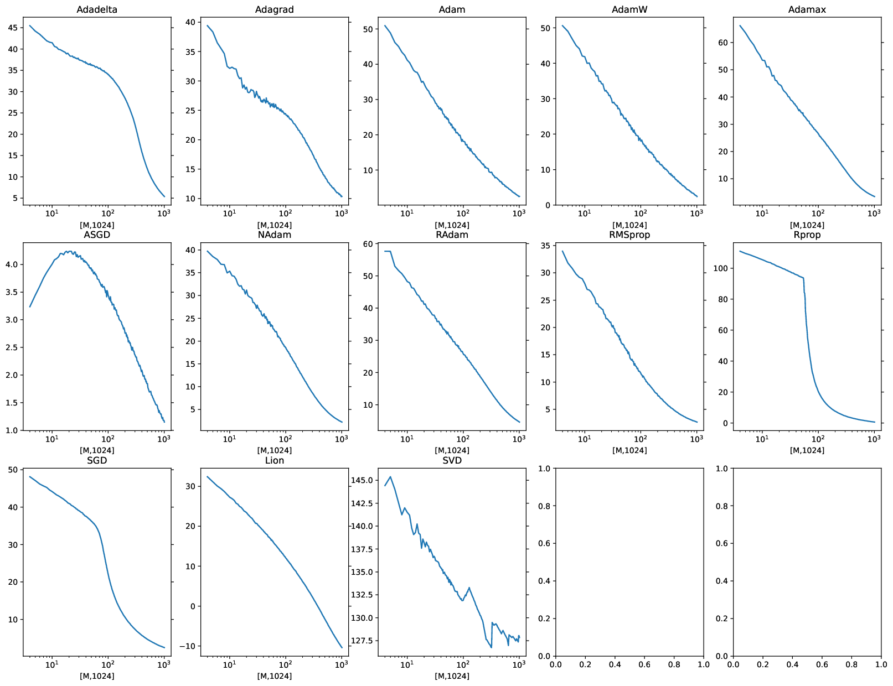
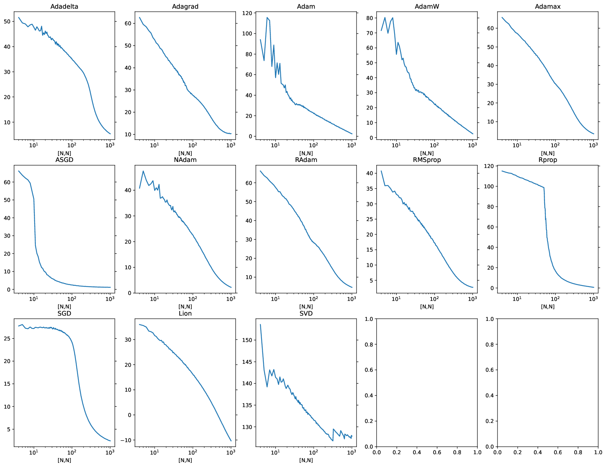
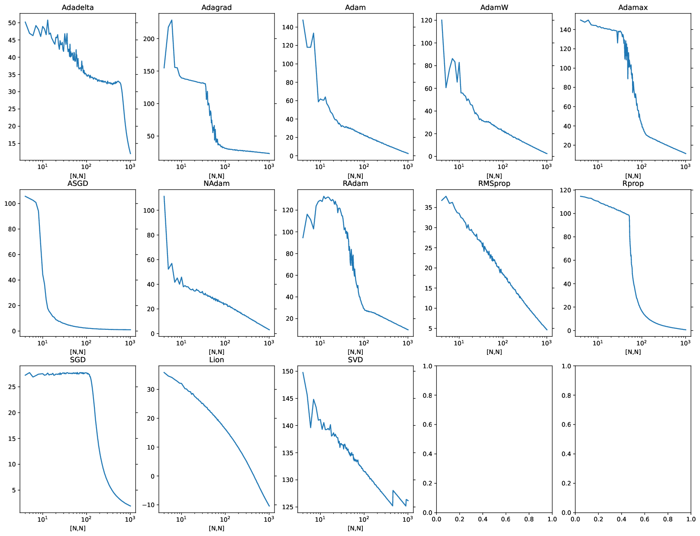

# How well does backprop + standard optimizers work in high-D space?

Most deep learning models use very high dimensional internal vector representations; large transformers, for example, can use length 12k vectors.  This lead me to wonder how well backprop functions in these extremely high dimensional spaces.  

This is a small experiment to answer that question: how well does backprop work to learn an arbitrary M x N matrix?   That is, given unit vectors $x$ (M-dimensional), matrix $\Phi$ (cropped to M x N from a random orthogonal matrix), and vector y (N-dim): 

$$y = x \Phi$$

The task is to recover $\Phi'$ from $(x,y)$ supervised pairs.  
(Note that $\Phi$ is scaled so that $y$ (length N) is also a unit vector.  This is to reduce gradient scaling issues.)

The network being trained is as simple as possible: 
```
class Net(nn.Module): 
	def __init__(self, M,N):
		super(Net, self).__init__()
		self.l1 = nn.Linear(M, N)

	def forward(self, x): 
		y = self.l1(x)
		return y
```
Training details: 
* Bias was left on -- of course it's not needed, but it did not seem to affect results.  
* Batch size is fixed at 32.
* 500 batches were presented during training; from inspection (see movies) this is sufficient except for a few slow cases (SGD).
* Reported figures are for test loss; however, there was never any difference between test and train loss (unsurprisingly).  
* Weight decay is set to 0.01, and the learning rate to 0.01 for most of the algorithms (exceptions listed below). 
* Performance was compared to Numpy's np.linalg.lstsq -- this is marked as "SVD" on the plot (though internally it may not use SVD.?)

The following optimizers are tested (learning rate, if not 0.01, listed after): Adadelta (0.5), Adagrad (0.1), Adam, AdamW, ASGD, NAdam, RAdam, RMSprop, SGD (0.1), and Lion.  
The size of $\Phi$ is systematically varied by sweeping M and N from [4 .. 1024) while holding the opposite dimension fixed, and then while varying both so that $\Phi$ was square and orthonormal.  

# Take-aways: 
1. __In high dimensions, all the optimizers work very poorly.__  
2. SVD works very well in all instances tested, with orders of magnitude less data.  This serves as a positive control.
3. There is significant variance between each of the tested optimizers; see plots. 




Above, results for "fat" matrices: M < N, with M plotted on the x-axis, SNR in dB on the y-axis.  The model needs to predict 1024 dimensions using a smaller $x$ - e.g. $y$ is 1024 dimensional but has a lower rank, plotted on the x-axis.  Most algorithms show power-law decay of SNR with increasing rank.  Rprop is great at low rank, shows a sharp transition around 60 - not sure why?  ASGD is non-monotonic, but note performance is always low.  


Results for "skinny" matrices: M > N, with N plotted on the x-axis, SNR in dB on the y-axis.  The model needs to predict N-dim $y$ from 1024-dim $x$, -- find a predictive low-rank subspace.  Adam and AdamW work OK when $y$ is low-D; Adagrad works somewhat when $y$ is high-D; the rest don't work well.  



Results orthonormal $\Phi$, M=N plotted on the x-axis, SNR in dB on the y-axis.  All optimizers work very well learning small matrices, with Rprop being a stand-out winner, with Adam a close second.  Likewise, all algorithms regress to ~ 0 SNR at 1000 x 1000, except for Lion, which has negative SNR (it diverges).  



Above, repeated orthonormal $\Phi$ experiment with weight decay disabled. 


**Please submit a pull request if you find a bug!** I think this all is sound, exp given the presence of positive controls, but I might be wrong!
