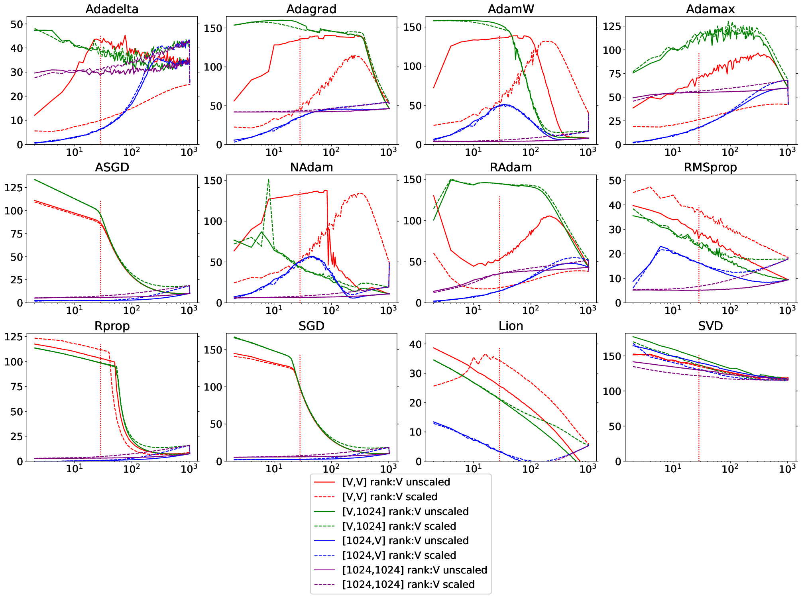
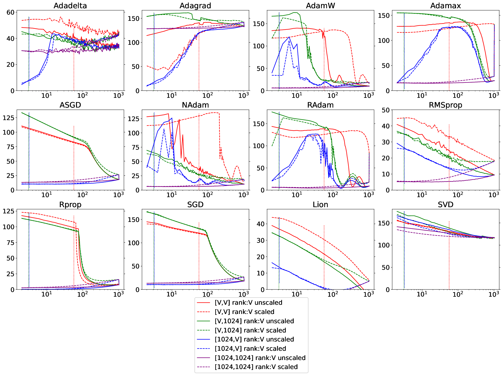

# How well does backprop + standard optimizers work in high-D space?

Most deep learning models internally use very high dimensional vector representations; large transformers, for example, can use length 12k vectors.  This lead me to wonder how well backprop functions in such high dimensional spaces.  

This is a small experiment to answer that question: how well does backprop work to learn an arbitrary M x N matrix?   That is, given unit vectors $x$ (M-dimensional), matrix $\Phi$ (cropped to M x N from a random orthogonal matrix), and vector y (N-dim): 

$$y = x \Phi$$

The task is to recover $\Phi'$ from $(x,y)$ supervised pairs.
(Note that $\Phi$ is scaled so that $y$ (length N) is also a unit vector.  This is to reduce gradient scaling issues, and to be consisent with the usual application of LayerNorm)

This is the "matrix sensing problem", which there is an extensive literature of, eg. https://arxiv.org/abs/2301.11500
The results presented are an empirical investigation to the problem with controlled rank and exact parameterization, to expose the behavior of commonly-used optimizers.

The network being trained is as simple as possible: 
```
class Net(nn.Module): 
	def __init__(self, M,N):
		super(Net, self).__init__()
		self.l1 = nn.Linear(M, N)

	def forward(self, x): 
		y = self.l1(x)
		return y
```
Training details: 
* Bias was left on -- of course it's not needed, but it did not seem to affect results.  
* Batch size is fixed at 32.
* 500 or 2000 batches were presented during training; the two plots below compare these.
* Reported figures are for test loss; however, there was never any difference between test and train loss (unsurprisingly).
* Weight decay is set to 0.0, and the learning rate to 0.01 for most of the algorithms (exceptions listed below).  Weight decay significantly decreased performance for most optimizers.
* Performance was compared to the SVD solution to the least-squares regression problem (in turn compared against numpy's linalg.lstsq solution -- same performance). 

The following optimizers are tested (learning rate, if not 0.01, listed after): Adadelta (0.5), Adagrad (0.1), Adam, AdamW, ASGD, NAdam, RAdam, RMSprop, SGD (0.1), and Lion.  Adam is left off the plots here since it's the same as AdamW with weight_decay=0

The size of $\Phi$ is systematically varied by sweeping M and N from [4 .. 1024) while holding the opposite dimension fixed, and then while varying both so that $\Phi$ was square and orthonormal.

Singular values of $\Phi$ were either left unscaled - so that $\Phi$ is a rotation matrix - or were scaled to be more representative of real-world data. 

## Results: 
1. Adagrad works better than AdamW for matrix sensing, given enough compute. 
2. Scaling of singular values matters for square matrices, likely because backprop adds dimensions based on the magnitude of the singular values. 
2. SVD works very well in all instances tested, with orders of magnitude less data.
3. There is significant variance between each of the tested optimizers.




Above, results with training for 500 batches.
Solid lines are for unscaled singular values; dashed lines are with them scaled between [4,1] (and later scaled so that $norm_2(y) = 1$)
As indicated in the legend: 
* Red = square matrices; 
* Green = "fat" matrices.  These should be the same result as red - same matrix rank, just replicated over 1024 output dimensions - but vector normalization makes the problem different, as shown. 
* Blue = "skinny" matrices.  More typical regression situation.  Same number of parameters as red. 
* Purple = Square 1024 x 1024 matricies with variable rank.  Input space is full, but output space is smaller.  Ada* algorithms work well here. 

Dashed vertical line is the "Chinchilla" line where the number of training examples = 20 * number of parameters for square matrices (Red).  Other Chinchilla lines for green and blue are off the chart -- all networks trained below the Chinchilla limit.  See below for more.



Same experiment, repeated with 2000 training batches.  
* Adagrad is the only algorithm that works well in purple - 1024 x 1024 low-rank, as well as for all high-D cases.
* Adagrad doesn't work for low-D tall matrices and scaled square matrices.  Adam works better in this case.  Not sure why? 
* ASGD, SGD and RProp are all compute / data limited -- but still competitive with Adam on fat matrices. 
* This plot shows the Chinchilla line for blue and green (skinny and fat).  Purple is still off the chart, reminding us just how much data is required: 20M vectors for all of the purple lines, 300x that presented. 

## Replication:

To replicate these experiments, run 

	./runall.sh -e 5
	./runall.sh -e 20
	
The scripts are set up for 32 cores and 2 GPUs.  Edit run8.sh to suit your system configuration. 

**Please submit a pull request or leave a comment if you have a thought find a bug!** I think this all is sound, exp given the presence of positive controls, but I might be wrong!
